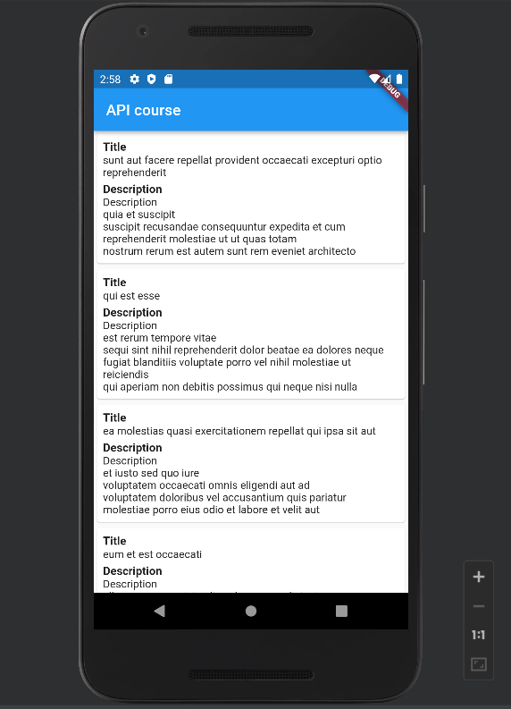
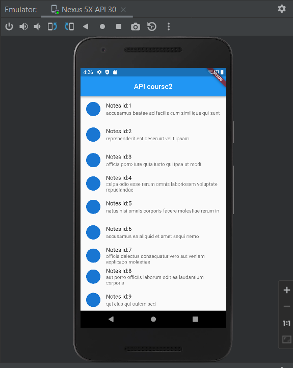

# Flutter Get API call with Null Safety || Building List with JSON Data with custom Model
The data from api like title, description, url etc. are fetched from the api from JSON placeholder
[online documentation](https://jsonplaceholder.typicode.com/) and presented in the app

##Layout
This project is a starting point for a Flutter application.

